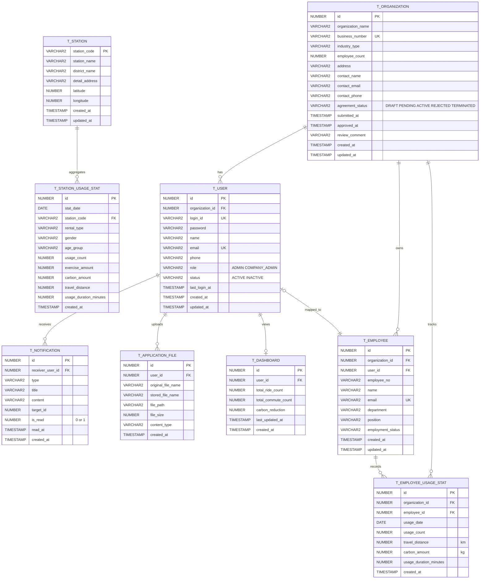

# TtaIt ERD

develop 브랜치 최신 스키마 기준 ERD입니다.

## ERD

## 테이블 요약

| 테이블 | 설명 | 비고 |
|--------|------|------|
| T_ORGANIZATION | 협약 기업 마스터 | 협약 상태 관리 (DRAFT→PENDING→ACTIVE/REJECTED) |
| T_USER | 사용자 계정 (관리자/기업관리자) | organization_id로 기업 연결 |
| T_EMPLOYEE | 기업 임직원 | organization_id, user_id FK |
| T_EMPLOYEE_USAGE_STAT | 임직원 일별 따릉이 이용 통계 | 이용 횟수, 거리, 탄소 절감량, 시간 |
| T_STATION | 따릉이 대여소 마스터 | CSV 자동 적재 |
| T_STATION_USAGE_STAT | 대여소별 이용 통계 | CSV 자동 적재, 대시보드 집계용 |
| T_NOTIFICATION | 실시간 알림 | WebSocket 푸시 대상 |
| T_APPLICATION_FILE | 협약 신청 첨부파일 | 로컬 파일 저장소 연동 |
| T_DASHBOARD | 대시보드 요약 지표 캐시 | 누적 이용량, 탄소 절감량 |

## 인덱스

| 인덱스 | 대상 | 용도 |
|--------|------|------|
| IDX_USER_ORGANIZATION | T_USER(organization_id) | 기업별 사용자 조회 |
| IDX_EMPLOYEE_ORGANIZATION | T_EMPLOYEE(organization_id) | 기업별 임직원 조회 |
| IDX_EMPLOYEE_USAGE_STAT_ORG_DATE | T_EMPLOYEE_USAGE_STAT(organization_id, usage_date) | 기업 대시보드 기간별 집계 |
| IDX_EMPLOYEE_USAGE_STAT_EMPLOYEE | T_EMPLOYEE_USAGE_STAT(employee_id) | 임직원별 이용 조회 |
| IDX_EMPLOYEE_USAGE_STAT_DATE | T_EMPLOYEE_USAGE_STAT(usage_date) | 날짜별 이용 조회 |
| IDX_STATION_DISTRICT | T_STATION(district_name) | 지역별 대여소 조회 |
| IDX_STATION_USAGE_STAT_DATE_STATION | T_STATION_USAGE_STAT(stat_date, station_code) | 대시보드 기간+대여소 집계 |
| IDX_STATION_USAGE_STAT_DASHBOARD | T_STATION_USAGE_STAT(stat_date, station_code, usage_count) | 커버링 인덱스 |
| IDX_ORGANIZATION_STATUS_SUBMITTED | T_ORGANIZATION(agreement_status, submitted_at, id) | 관리자 신청 목록 필터 |
| IDX_NOTIFICATION_USER | T_NOTIFICATION(receiver_user_id) | 사용자별 알림 조회 |
| IDX_DASHBOARD_USER | T_DASHBOARD(user_id) | 사용자별 대시보드 조회 |
