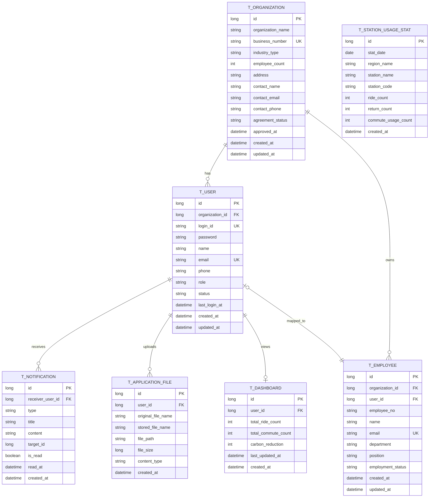

# TtaIt ERD

TtaIt 백엔드 초기 기능 범위를 기준으로 정리한 ERD 초안입니다.

## Mermaid ERD

## 메모

- `T_USER`는 관리자, 기업 관리자, 기업 사용자를 모두 담는 공통 계정 테이블입니다.
- `T_ORGANIZATION`은 협약 기업 마스터입니다. 기업 관리자가 회원가입 시점에는 `organization_id = NULL`, 협약 신청이 승인되면 연결됩니다.
- `T_STATION_USAGE_STAT`은 CSV 적재 기반 통계 데이터 저장용이며, 대시보드 차트/집계에 사용됩니다.
- `T_DASHBOARD`는 사용자 개인(또는 기업) 대시보드 요약 지표를 저장합니다. (누적 이용량, 탄소 절감량 등)
- `T_APPLICATION_FILE`은 기업 협약 신청 첨부 파일을 `user_id` 기준으로 저장합니다.
- 협약 신청(`t_partnership_application`) / 접근 로그(`t_access_log`) 테이블은 요구사항 구현 단계에서 추가 예정입니다.
