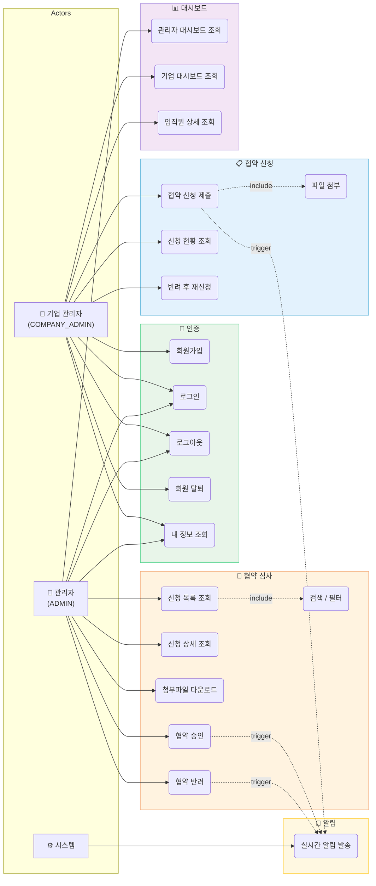
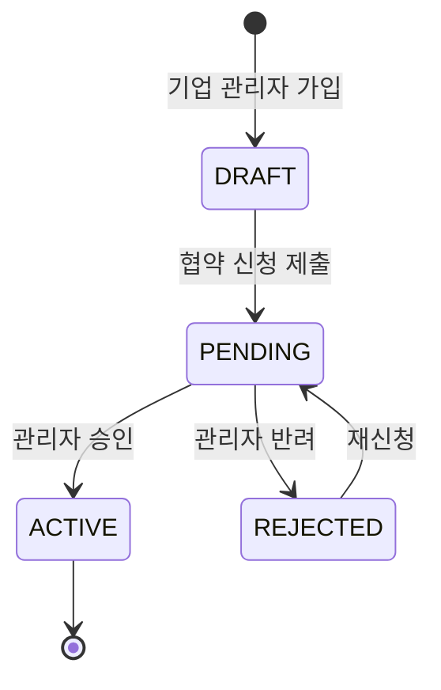

# 유스케이스 다이어그램

## 전체 시스템

## 액터 설명

| 액터 | 역할 | 주요 기능 |
|------|------|-----------|
| 기업 관리자 | 기업 대표로 협약 신청 및 임직원 관리 | 협약 신청/재신청, 기업 대시보드, 임직원 현황 |
| 관리자 | 시스템 전체 관리 | 협약 심사(승인/반려), 관리자 대시보드 |
| 시스템 | 자동 처리 | 실시간 알림 발송 (WebSocket) |

## 협약 상태 흐름

